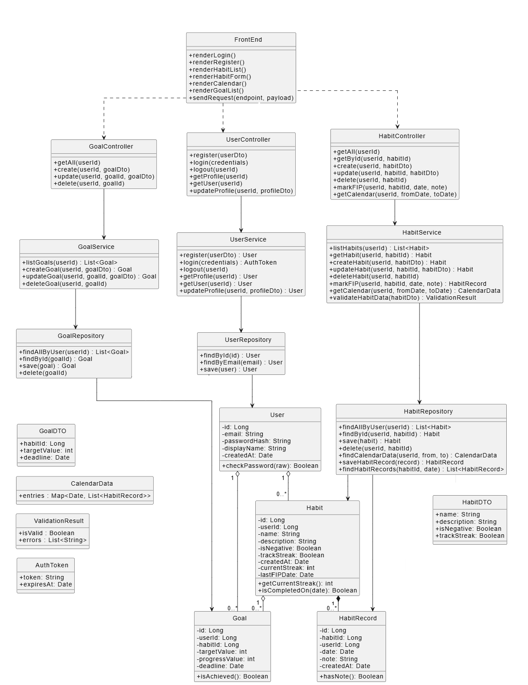

# Диаграмма классов

| Термин                     | Определение                                                                 |
|---------------------------|------------------------------------------------------------------------------|
| User                   | Зарегестрированный пользователь сервиса         |
| Habit               | Привычка, которую пользователь отслеживает через сервис |
| Streak                   | Числовое выражение последовательного и ежедневного соблюдения привычки         |
| HabitRecord                   | Факт исполнения отслеживаемой привычки         |
| Goal                   | Годовая цель по выбранной привычке         |
