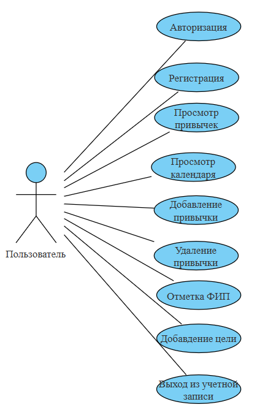

# 📘 Диаграмма вариантов использования — HabitLoop

## 📚 Глоссарий

| Термин                     | Определение                                                                 |
|---------------------------|------------------------------------------------------------------------------|
| Пользователь              | Зарегестрированный человек, использующий приложение                          |
| Привычка               | Привычка, которую пользователь отслеживает через сервис |
| Заметка              | Дополнительная запись к конкретному факту соблюдения привычки                      |
| Серия                   | Числовое выражение последовательного и ежедневного соблюдения привычки         |
| Календарь привычек                   | Календарь, на котором отмечено выполнение привычек в виде иконок         |
| ФИП                   | Факт исполнения отслеживаемой привычки         |

## 📑 Содержание

1 Актёры  
2 Варианты использования  
2.1 Войти в свою учётную запись  
2.2 Зарегистрироваться  
2.3 Просмотреть список привычек
2.4 Просмотреть календарь привычек 
2.5 Добавить привычку
2.6 Удалить привычку
2.7 Отметить ФИП 
2.8 Добавить цель
2.9 Выйти из учётной записи

## 🎭 1 Актёры

| Актёр                     | Описание                                                                    |
|---------------------------|------------------------------------------------------------------------------|
| Пользователь              | Зарегестрированный человек, использующий приложение                                            |

## 2 Варианты использования

### 2.1 Войти в свою учётную запись

**Описание:** Позволяет пользователю авторизоваться.  
**Предусловия:** Выбран способ "Sign in".

**Основной поток:**
- Приложение отображает окно входа;
- Пользователь вводит email и пароль;
- Приложение проверяет данные;
- Присваивает статус "зарегистрирован";
- Переход на главный экран.

**Альтернативный поток А1:**
- Неверный пароль → сообщение об ошибке;
- Пользователь может повторить попытку или отменить.

### 2.2 Зарегистрироваться

**Описание:** Создание новой учётной записи.  
**Предусловия:** Выбран способ "Sign up".

**Основной поток:**
- Приложение отображает окно регистрации;
- Пользователь вводит email и пароль;
- Приложение проверяет уникальность email;
- Создаёт профиль;
- Присваивает статус "зарегистрирован";
- Переход на главный экран.

**Альтернативный поток А2:**
- Email уже используется → сообщение об ошибке;
- Запрос нового email.

### 2.3 Просмотреть список привычек

**Описание:** Отображение всех отслеживаемых привычек.  
**Предусловия:** Пользователь вошёл в приложение.

**Основной поток:**
- Приложение загружает список привычек;
- Отображает их в виде записей;
- Если список пуст — выполняется А3.

**Альтернативный поток А3:**
- Приложение сообщает об отсутствии отслеживаемых привычек.

### 2.4 Просмотреть календарь привычек

**Описание:** Отображение календаря привыек.  
**Предусловия:** Пользователь выбрал пункт меню "календарь".

**Основной поток:**
- Приложение получает визуализацию календаря привычек;
- На каждом дне иконками отображаются выполненные привычки;
- При выборе конкретной привычки — выполняется А4.

**Альтернативный поток А4:**
- На календаре отображается только одна выбранная привычка. Если в этот день созданна пометка, она отмечается значком **'*'**. При нажатии на день с пометкой — выполняется А5.

**Альтернативный поток А5:**
- Появляется всплывающее окно ФИБ с текстовой пометкой.

### 2.5 Добавить привычку

**Описание:** Добавление новой привычки для отслеживания.  
**Предусловия:** Пользователь авторизован.

**Основной поток:**
- Пользователь нажимает "add new habbit";
- Пользователь выбирает название привычки, её описание, иконку, выбирает плохая ли это привычка и нужно ли сервису вести учет серии и наэимает "save";
- Прилоение возвращается на список отслеживаемых привычек.

### 2.6 Удалить привычку

**Описание:** Удаление отслеживаемой привычки.  
**Предусловия:** Привычка уже добавлена.

**Основной поток:**
- Пользователь нажимает "Select";
- Пользователь выбирает привычку и нажимет кнопку "delete";
- Обновляется список привычек.

### 2.7 Отметить ФИП

**Описание:** Пользователь отмечает ФИП.  
**Предусловия:** Открыт список отслеживаемых привычек.

**Основной поток:**
- Пользователь открывает выпадающее окно выбранной привычки;
- Пользователь добавляет заметку (опционально);
- Пользователь нажимает "+";
- ФИП отмечен и учтен в серии (если она ведется).

### 2.8 Добавить цель

**Описание:** Создание годовой цели.  
**Предусловия:** Пользователь создал привычки.

**Основной поток:**
- Пользователь нажимает на "add goal" на странице профиля;
- В появившеся окне пользователь выбирает привычку и значение;
- Пользователь нажимат кнопку "save".

### 2.9 Выйти из учётной записи

**Описание:** Завершение сессии.  
**Предусловия:** Пользователь нажал "Log out".

**Основной поток:**
- Приложение завершает сессию;
- Возвращает пользователя на экран входа.